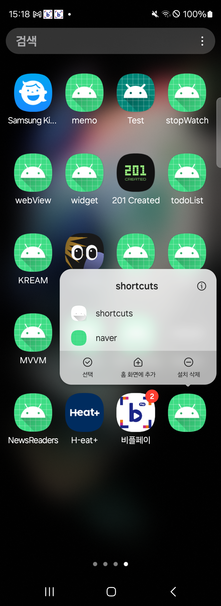
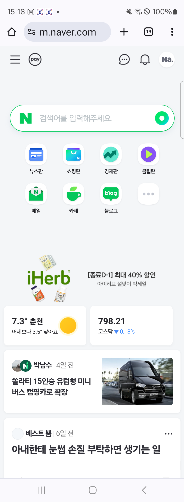
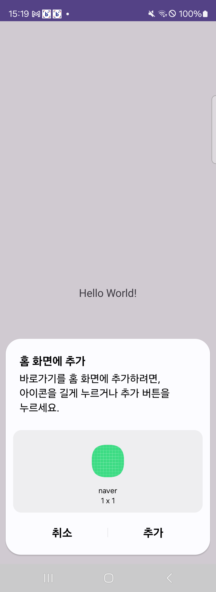
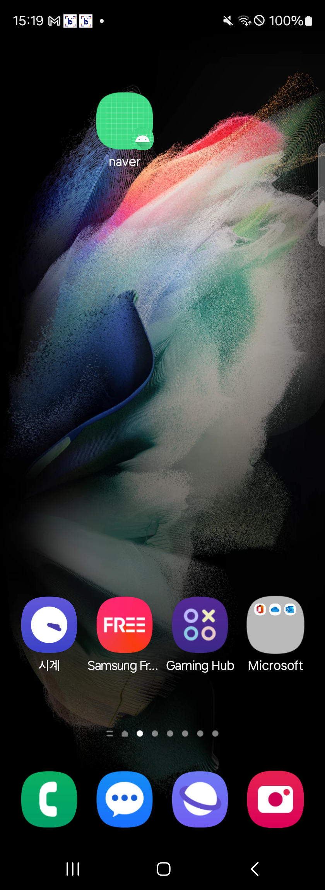

# shortcuts

### 종류
- Static Shortcuts
: 일반적인 활동을 shortcut으로 연결할 때 가장 적합한 형태. 일정 만들기, 이메일 보내기와 같이 일상적인 정형화된 업무를 수행할 수 있도록 제공 할 수 있다.
- Dynamic Shortcuts
: 상황에 맞는 작업이 필요할 때 사용하기 적합. 동적으로 업데이트 하면서 알맞게 동작
- Pinned Shortcuts 
: 특정 웹사이트로 이동하는 경우에 사용하기 적합.

### static Shortcuts

shortcuts 클릭하면 메인으로 들어간다 !

### Dynamic Shortcuts

naver 클릭하면 네이버 웹 창 열림

### Pinned Shortcuts

추가 클릭하면 바탕화면에 해당 앱 추가 됨

